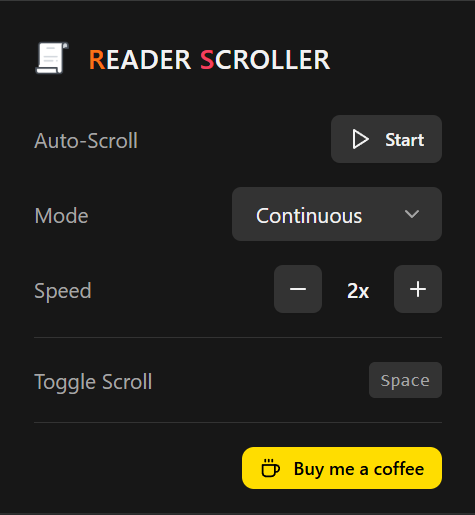

# Reader Scroller - Chrome Extension

A modern Chrome extension for auto-scrolling web pages, perfect for reading articles, manga, webcomics, and more.



## Features

- 🔄 **Two Scrolling Modes:**
  - **Continuous**: Smooth, continuous scrolling with adjustable speed (1x-10x)
  - **Interval**: Scroll by page at customizable intervals (1-30 seconds)

- ⚡ **Keyboard Shortcut:**
  - `Space` - Start/Stop scrolling (works in popup and on page)

- 🎨 **Modern Dark UI**: Clean, minimal interface built with React and Tailwind CSS

- 👁️ **Auto-fade**: Panel becomes transparent after 5 seconds of inactivity

- ☕ **Support**: Buy me a coffee button with QR code on hover

## Tech Stack

- **React 18** - UI Framework
- **TypeScript** - Type safety
- **Tailwind CSS** - Styling
- **Vite** - Build tool
- **shadcn/ui patterns** - UI components
- **Chrome Extension Manifest V3**

## Installation

### From Chrome Web Store

[Add to Chrome](https://chromewebstore.google.com/detail/reader-scroller/gifalhdflpgdnekdfninhpkkdnaoclim)

### From Source (Development)

1. Clone this repository:

   ```bash
   git clone https://github.com/guigonzalezz/reader-scroller-extension.git
   cd reader-scroller-extension
   ```

2. Install dependencies:

   ```bash
   npm install
   ```

3. Build the extension:

   ```bash
   npm run build
   ```

4. Load the extension in Chrome:
   - Open Chrome and navigate to `chrome://extensions/`
   - Enable "Developer mode" (toggle in top right)
   - Click "Load unpacked"
   - Select the `dist` folder from this project

### Development Mode

For development with watch mode:

```bash
npm run build:watch
```

This will watch for changes and rebuild automatically. You'll need to reload the extension in Chrome after each build.

## Project Structure

```
├── src/
│   ├── components/         # React components
│   │   ├── ui/            # UI primitives (Button, Select, Kbd)
│   │   └── ReaderToolsPopup.tsx  # Main popup component
│   ├── content/           # Content scripts
│   │   └── content-script.ts    # Scrolling logic injected into pages
│   ├── lib/               # Utilities
│   │   ├── utils.ts       # CN helper for className merging
│   │   └── chrome-utils.ts # Chrome API helpers
│   ├── popup/             # Popup entry point
│   │   ├── index.html
│   │   └── main.tsx
│   ├── styles/            # Global styles
│   │   └── globals.css
│   ├── types/             # TypeScript types
│   │   └── index.ts
│   └── manifest.json      # Chrome extension manifest
├── images/                # Extension icons and assets
├── dist/                  # Built extension (generated, git ignored)
├── package.json
├── tailwind.config.js
├── tsconfig.json
└── vite.config.ts
```

## Configuration

### Speed Settings (Continuous Mode)

| Speed | Pixels per frame |
| ----- | ---------------- |
| 1x    | 0.5              |
| 2x    | 1                |
| 3x    | 1.5              |
| 4x    | 2                |
| 5x    | 3                |
| 6x    | 4                |
| 7x    | 5                |
| 8x    | 7                |
| 9x    | 10               |
| 10x   | 15               |

### Interval Settings (Interval Mode)

Scrolls approximately 90% of the viewport height at each interval (1-30 seconds).

## Usage

1. Click the Reader Scroller icon in Chrome toolbar
2. Select your preferred mode (Continuous or Interval)
3. Adjust speed/interval using the +/- buttons
4. Click "Start" or press `Space` to begin auto-scrolling
5. Click "Stop" or press `Space` again to pause

**Note:** When you change the speed or interval while scrolling, the scroll will stop automatically. Click "Start" again to continue with the new settings.

## Contributing

1. Fork the repository
2. Create your feature branch (`git checkout -b feature/amazing-feature`)
3. Commit your changes (`git commit -m 'Add some amazing feature'`)
4. Push to the branch (`git push origin feature/amazing-feature`)
5. Open a Pull Request

## Support

If you find this extension useful, consider:

- ⭐ Giving it a star on GitHub
- ☕ [Buying me a coffee](https://buymeacoffee.com/guigonzalezz)

## License

MIT License - feel free to use this project however you'd like.

## Author

**Guilherme Gonzalez**

- GitHub: [@guigonzalezz](https://github.com/guigonzalezz)
