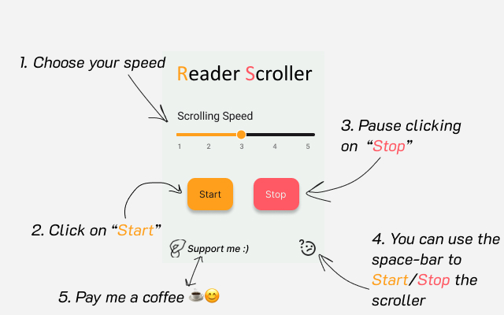

<h1 width="100%"  align="center"> 
  
</h1>
<h3 align="center"> 
Extension for scrolling down a page using for reading or seeing a tab on the browser
</h3>

## Summary
If you are an enthusiastic or a manwha lovers, you should use this extension, this will help you to read making you dont need your mouse.

Imagine you are in your lunch time at work, and you are eating, and decide to read a manwha while you eat, with this extension you dont need to keep scrolling the page by your own, you can set a speed and control using the spacebar only.

<h3 align="center">

</h3> 

## Tecnologies
- CommonJS
- CSS
- HTML

## Feedback

Every feedback is essential, you can reach me on my e-mail: gcgonzalez99@hotmail.com
